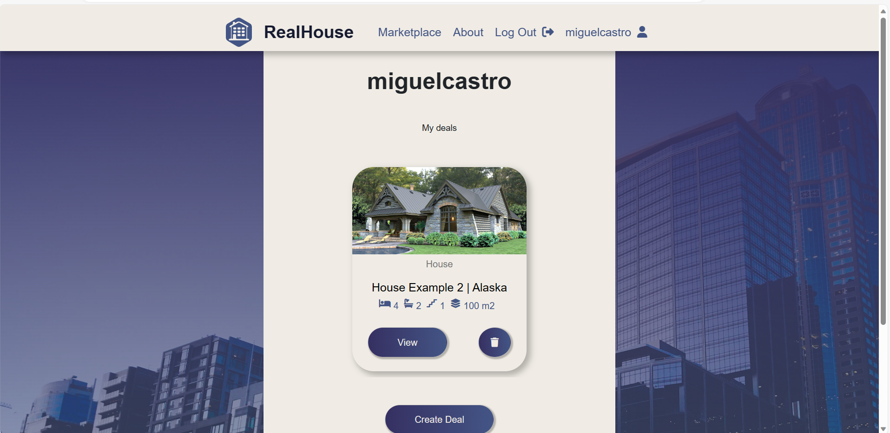
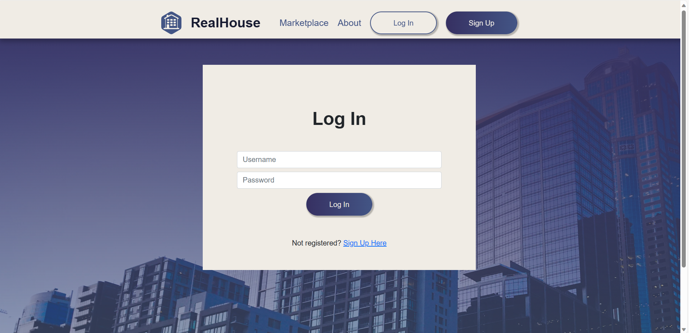
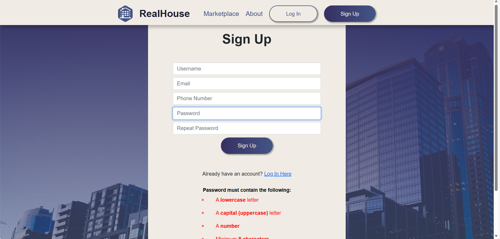
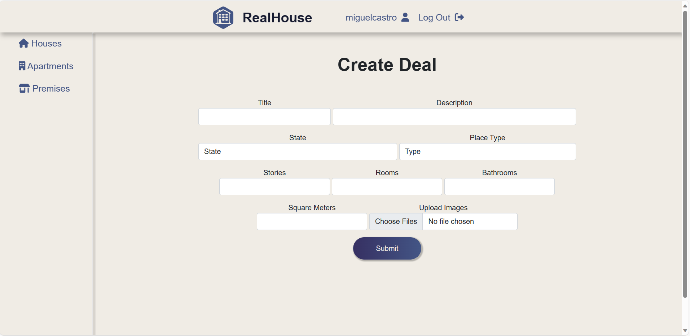
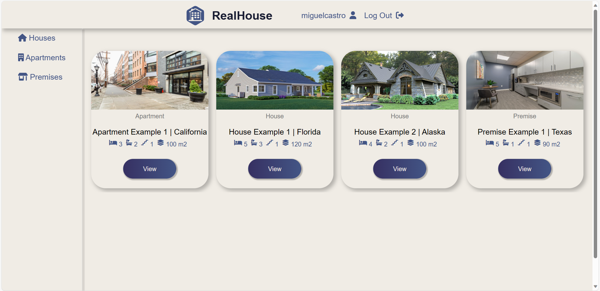
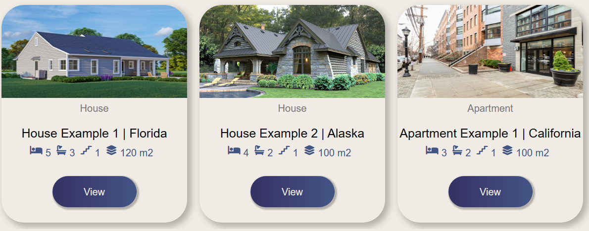
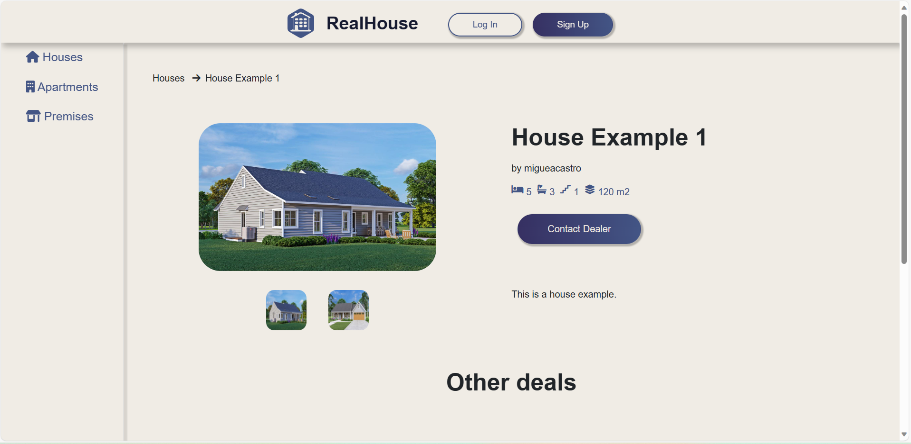

# RealHouse
#### Video Demo:  <https://youtu.be/iV3ZL-GKp70>
#### Description: A website where you can sponsor a deal of your place: whether it's an apartment, house or premise

## Features
+ Flask
+ CS50's Python Module
+ Javascript
+ Bootstrap
+ CSS.

## Explanation
### Main Website:
 + When you enter the website see a main page styling that uses the first layout "layout1.html" which uses javascript in order to toggle the nav menu to see the available pages.

 + It also has a hidden element that displays the username if there is an available session of Flask with a logout button.

### - Index

  + Displays a hero with a description of the website. and uses Flask to include the listing of random deals of the marketplace using the query in "app.py". ("index.html).

### - Log In

 + Displays a form where the user has to type the username and the password, if it isn't found in the
table of users "realhouse.db" it will display an apology, same if the password is wrong. ("login.html").

### - Sign Up

+ Displays a form where the user has to type the username, email, phone number, password and password confirmation. It uses a script of JavaScript that enables an event listener to the inputs in the form in order to check the requirements of the password, and prevent the user to submit.
+ If it's wrong, it shows an apology if the user has been already registered. ("signin.html").

### - Account

+ Uses Flask to display the username
+ Includes the "listing.html" in order to show the deals the user has posted using a SQL query in "app.py".
+ Adds a delete button for each deal of the user.
+ Displays a button to create a new deal. ("account.html").

### - About
+ Shows details about the project.

## Marketplace
+ Uses Flask to include "layout2.html" template.
+ Incorporates a sidebar in desktop mode, which is moved to the navbar in mobile devices

### - Create Deal

+ Displays a form in order to post a deal, which also requires at least one image to submit to deals table in "realhouse.db".
+ Uploads the images to the "/static/uploads" folder, where it can be accesed by using the correct URL introduced in the images table of "realhouse.db".

### - Marketplace

+ Displays a random selection of deals regardless of their category. ("marketplace.html").

### - Houses, Apartments, Premises
+ Display a selection of deals taking their category in count in "marketplace.html".

### - Listing

+ Uses Jinja2 in order to loop over the dictionary of the query in "app.py".
+ Displays elements of the current deal. (Title, State, Bedrooms, Bathrooms, Stories and Area)
+ Displays a button to View the deal, using a dynamic URL placing the deal_id in the variable of the URL.
+ If the user id and the dealer id are the same, it displays the delete button which leads to "/delete/id", executing a command in SQL that deletes the deal from the database.

### - Item details

+ Shows the category of the deal and the name.
+ Displays a big image of the main image in the images query that matches the deal_id
+ Displays other images in a small scale, which you can click on and replace the big image using JavaScript.
+ By using [malaman's js-image-zoom](https://github.com/malaman/js-image-zoom?tab=MIT-1-ov-file) create a function in Javascript that allows the user to zoom over the big image (It will disable in mobile devices to prevent bugs).
+ Show the information about the deal.
+ Display a button to contact the dealer. If clicked while being logged in, it will display the dealer info, otherwise it will lead you to the login page.
+ Include "listing.html" to show 5 other deals of the same category. ("itemdetails.html")
+ It will choose the deal based on the variable inside the "/marketplace/id" URL using Flask's dynamic URL.

### Delete
+ It will execute a command to delete the deal with the id inside of the dynamic URL "/delete/id".

## Helpers
### Imported from python, implements:
+ Apology function, which creates an error message page depending on  the text and error selected in the function invocation.

+ Login Required function, which prevents an anonymous user to accesing a specific route, (Based on PSET 9: Finance Login Required Function).

## Additional
### Thank you CS50.
